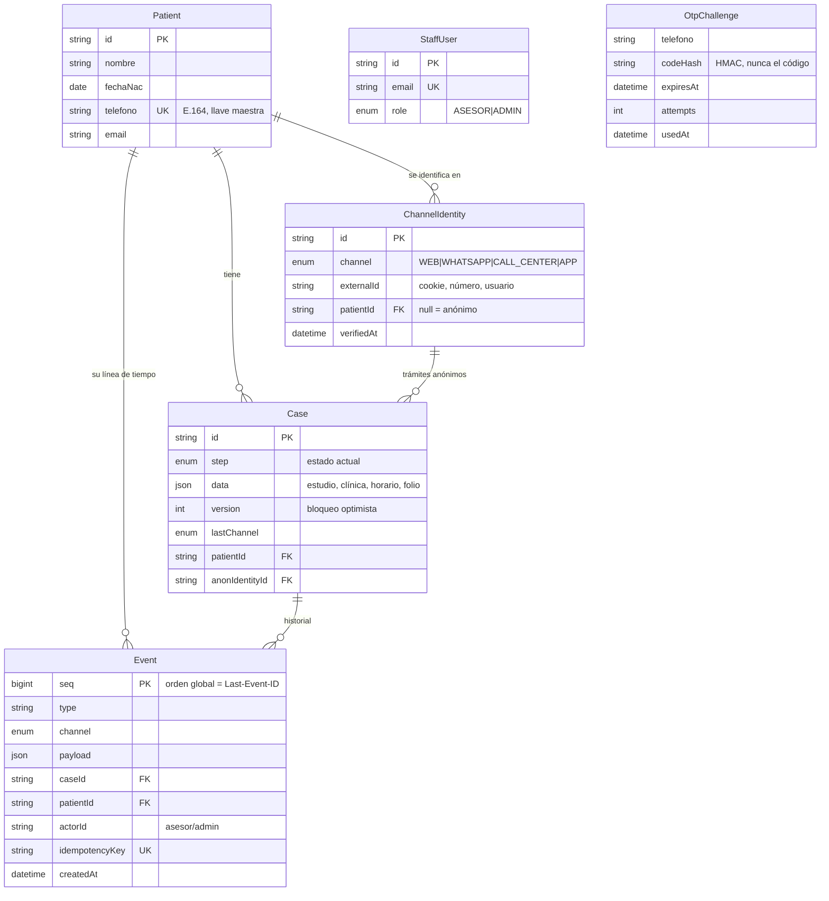
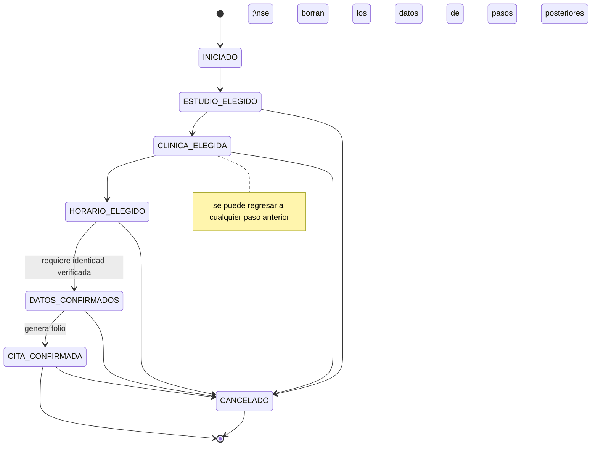

# Modelo de datos

Fuente: [`prisma/schema.prisma`](../prisma/schema.prisma).

```mermaid
erDiagram
  Patient ||--o{ ChannelIdentity : "se identifica en"
  Patient ||--o{ Case : "tiene"
  Patient ||--o{ Event : "su línea de tiempo"
  ChannelIdentity ||--o{ Case : "trámites anónimos"
  Case ||--o{ Event : "historial"

  Patient {
    string id PK
    string nombre
    date fechaNac
    string telefono UK "E.164, llave maestra"
    string email
  }
  ChannelIdentity {
    string id PK
    enum channel "WEB|WHATSAPP|CALL_CENTER|APP"
    string externalId "cookie, número, usuario"
    string patientId FK "null = anónimo"
    datetime verifiedAt
  }
  Case {
    string id PK
    enum step "estado actual"
    json data "estudio, clínica, horario, folio"
    int version "bloqueo optimista"
    enum lastChannel
    string patientId FK
    string anonIdentityId FK
  }
  Event {
    bigint seq PK "orden global = Last-Event-ID"
    string type
    enum channel
    json payload
    string caseId FK
    string patientId FK
    string actorId "asesor/admin"
    string idempotencyKey UK
    datetime createdAt
  }
  StaffUser {
    string id PK
    string email UK
    enum role "ASESOR|ADMIN"
  }
  OtpChallenge {
    string telefono
    string codeHash "HMAC, nunca el código"
    datetime expiresAt
    int attempts
    datetime usedAt
  }
```

## Máquina de estados del trámite

```mermaid
stateDiagram-v2
  [*] --> INICIADO
  INICIADO --> ESTUDIO_ELEGIDO
  ESTUDIO_ELEGIDO --> CLINICA_ELEGIDA
  CLINICA_ELEGIDA --> HORARIO_ELEGIDO
  HORARIO_ELEGIDO --> DATOS_CONFIRMADOS: requiere identidad verificada
  DATOS_CONFIRMADOS --> CITA_CONFIRMADA: genera folio
  CITA_CONFIRMADA --> [*]
  note right of CLINICA_ELEGIDA: se puede regresar a cualquier paso anterior;\nse borran los datos de pasos posteriores
  ESTUDIO_ELEGIDO --> CANCELADO
  CLINICA_ELEGIDA --> CANCELADO
  HORARIO_ELEGIDO --> CANCELADO
  DATOS_CONFIRMADOS --> CANCELADO
  CITA_CONFIRMADA --> CANCELADO
  CANCELADO --> [*]
```
